**Starting AWS EKS cluster manually in AWS web console**


 - [1. EKS cluster costs few cents per hour](#1-eks-cluster-costs-few-cents-per-hour)
 - [2. Allow seeing billing data for IAM user](#2-allow-seeing-billing-data-for-iam-user)
 - [3. Create budget in AWS to be notified by email](#3-create-budget-in-aws-to-be-notified-by-email)
 - [4. Create an extra user and group in AWS with admin privilages](#4-create-an-extra-user-and-group-in-aws-with-admin-privilages)
 - [5. Install awscli and kubectl binaries](#5-install-awscli-and-kubectl-binaries)
 - [6. Retrive programatic access from AWS and configure aws cli](#6-retrive-programatic-access-from-aws-and-configure-aws-cli)
 - [7. Create EKS control plane IAM role in AWS web console](#7-create-eks-control-plane-iam-role-in-aws-web-console)
 - [8. Create EKS node group IAM role in AWS web console](#8-create-eks-node-group-iam-role-in-aws-web-console)
 - [9. Create SSH key pain in AWS console](#9-create-ssh-key-pain-in-aws-console)
 - [10. Create EKS cluster in AWS web console](#10-create-eks-cluster-in-aws-web-console)
 - [11. Create EKS node group in AWS web console](#11-create-eks-node-group-in-aws-web-console)
 - [12. Create KUBECONFIG at your local](#12-create-kubeconfig-at-your-local)
 - [13. First NGINX deployment by kubectl to AWS EKS cluster created manually](#13-first-nginx-deployment-by-kubectl-to-aws-eks-cluster-created-manually)
 - [14. Clean up Network Interfaces](#14-clean-up-network-interfaces)
 - [15. Clean up AWS EKS node group](#15-clean-up-aws-eks-node-group)
 - [16. Clean up AWS EKS control plane](#16-clean-up-aws-eks-control-plane)
 - [17. Delete AWS IAM roles](#17-delete-aws-iam-roles)
 - [18. Install terrafrom binary at your local](#18-install-terrafrom-binary-at-your-local)
 - [19. Run terrafrom init and validate to initialize required plugins](#19-run-terrafrom-init-and-validate-to-initialize-required-plugins)
 - [20. Fill up terraform.eks.tfvars file with your AWS security credentials](#20-fill-up-terraform-eks-tfvars-file-with-your-aws-security-credentials)
 - [21. Run terrafrom plan and terrafrom apply](#21-run-terrafrom-plan-and-terrafrom-apply)

# 1. Starting AWS EKS cluster manually in AWS web console

<!-- - [1. EKS cluster costs few cents per hour](#1-eks-cluster-costs-few-cents-per-hour)-->
### 1. EKS cluster costs few cents per hour

<!-- - [2. Allow seeing billing data for IAM user](#2-allow-seeing-billing-data-for-iam-user)-->
### 2. Allow seeing billing data for IAM user

* Login to your **root** AWS account in **AWS Free Tier**.<br/>
* The access to a **billing information** is **disabled** by default for **IAM accounts**


* **Input user/password** from your phone to authenticate and login to the **root** account.<br/> 


* **Input MFA code** from your phone to authenticate and login to the **root** account.<br/> 


* Click at **My Account** item from **drop down menu**


* Click **Edit** to allow - ***Activate IAM Access*** for other IAM accounts than root account.

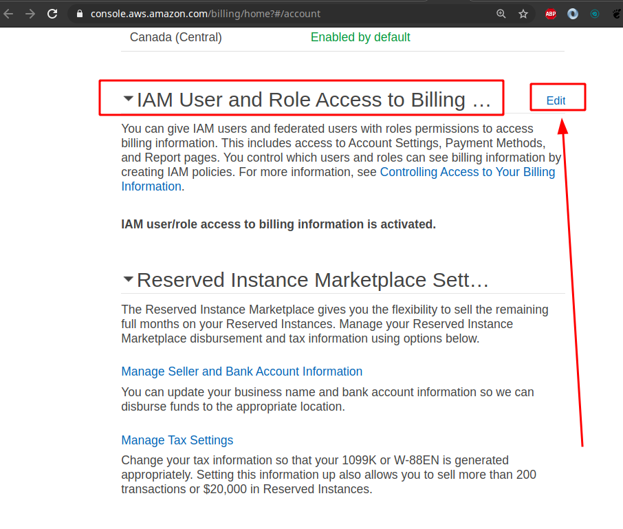

* Hit **Update** button to take ***Activate IAM Access*** for other IAM accounts than root account.


<!-- - [3. Create budget in AWS to be notified by email](#3-create-budget-in-aws-to-be-notified-by-email)-->
### 3. Create budget in AWS to be notified by email


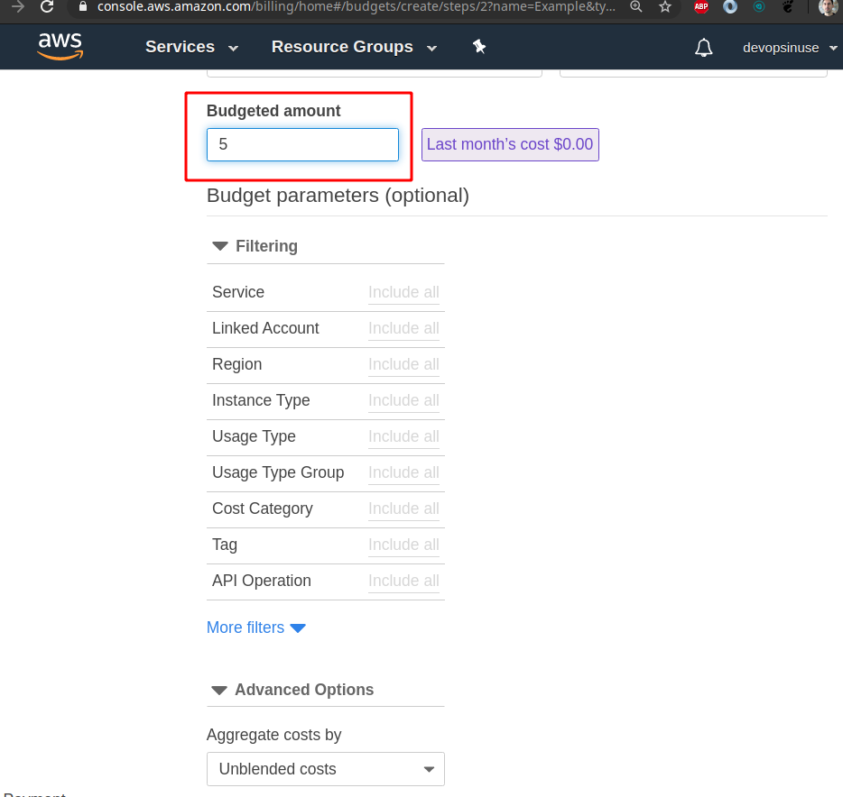


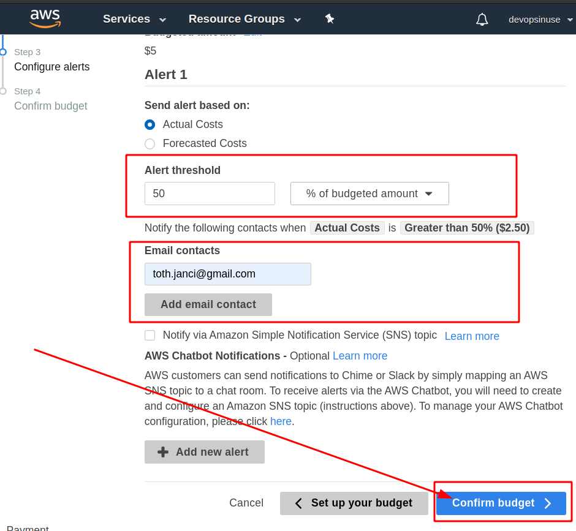


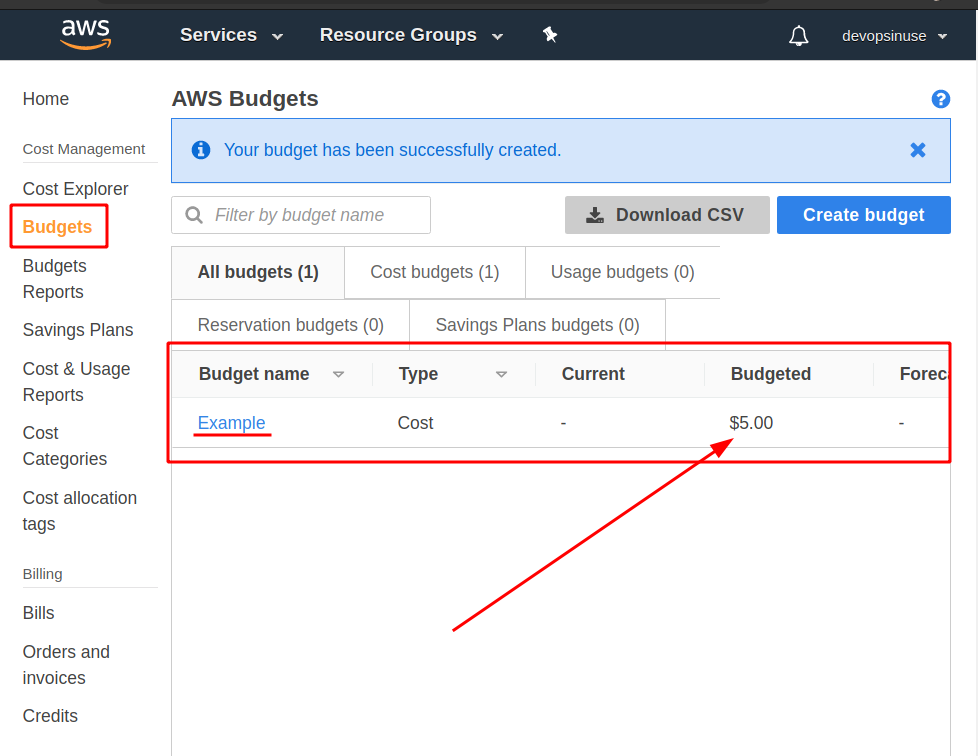

<!-- - [4. Create an extra user and group in AWS with admin privilages](#4-create-an-extra-user-and-group-in-aws-with-admin-privilages)-->
### 4. Create an extra user and group in AWS with admin privilages


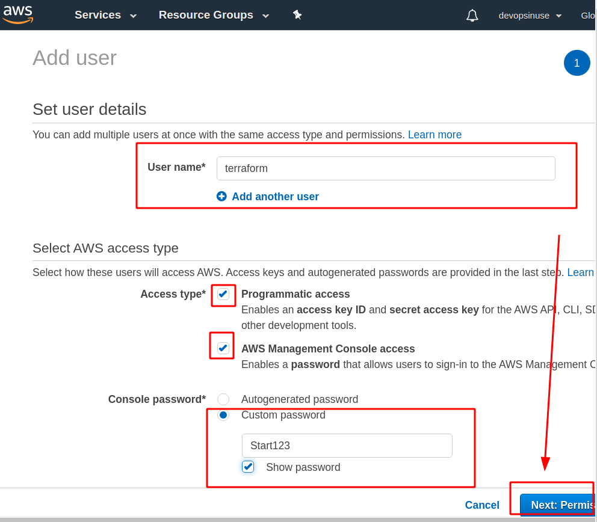


<!-- - [5. Install awscli and kubectl binaries](#5-install-awscli-and-kubectl-binaries)-->
### 5. Install awscli and kubectl binaries

* **Install** awscli binary
https://docs.aws.amazon.com/cli/latest/userguide/install-linux-al2017.html

* Please **configure** these two files:
  - ~/.aws/credentials
  - ~/.aws/config


Link: https://kubernetes.io/docs/tasks/tools/install-kubectl/

```
curl -LO https://storage.googleapis.com/kubernetes-release/release/v1.18.0/bin/linux/amd64/kubectl
chmod +x ./kubectl
sudo mv ./kubectl /usr/local/bin/kubectl
kubectl version --client
```
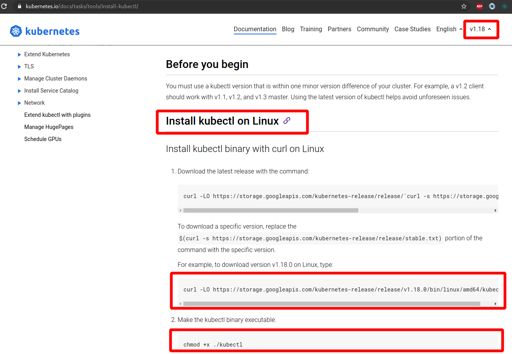

<!-- - [6. Retrive programatic access from AWS and configure aws cli](#6-retrive-programatic-access-from-aws-and-configure-aws-cli)-->
### 6. Retrive programatic access from AWS and configure aws cli

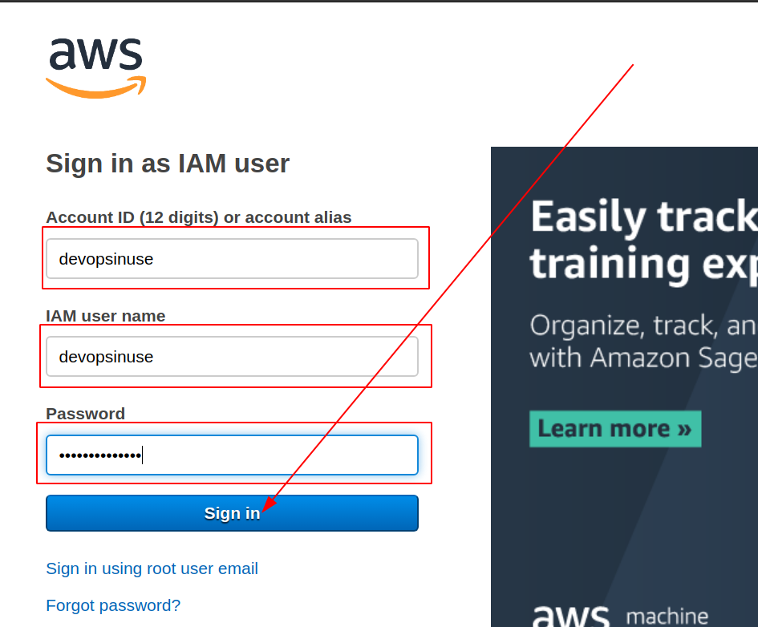


**edit file:** `~/.aws/credentials`
```bash
vim  ~/.aws/credentials

...
[terraform]
aws_access_key_id = ...
aws_secret_access_key = ...

[devopsinuse]
aws_access_key_id = ...
aws_secret_access_key = ...
...

:wq!
```

**edit file:** `~/.aws/config`

```bash
vim ~/.aws/config

...
[profile terraform]
region=eu-central-1

[profile devopsinuse]
region=eu-central-1
...

:wq!
```

**Make sure** that your `aws` is configured correctly and can talk to AWS
```bash
aws iam list-users --profile devopsinuse
{
    "Users": [
        {
            "Path": "/",
            "UserName": "devopsinuse",
            "UserId": "AFSDFSDFSDFSDFSD",
            "Arn": "arn:aws:iam::61111111116:user/devopsinuse",
            "CreateDate": "2020-04-20T08:03:36Z",
            "PasswordLastUsed": "2020-04-28T18:25:07Z"
        },
        {
            "Path": "/",
            "UserName": "terraform",
            "UserId": "ADSGDSDASDASFSDFSDB",
            "Arn": "arn:aws:iam::61111111116:user/terraform",
            "CreateDate": "2020-04-28T10:24:32Z"
        }
    ]
}
```
<!-- - [7. Create EKS control plane IAM role in AWS web console](#7-create-eks-control-plane-iam-role-in-aws-web-console)-->
### 7. Create EKS control plane IAM role in AWS web console


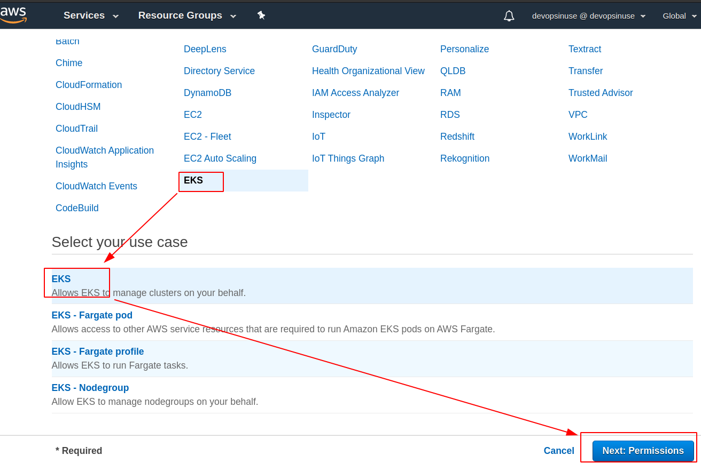


<!-- - [8. Create EKS node group IAM role in AWS web console](#8-create-eks-node-group-iam-role-in-aws-web-console)-->
### 8. Create EKS node group IAM role in AWS web console

Find **Roles** section under ***Identity and Access Management (IAM)***


Click at ***EC2*** from *Choose a use case* menu when creating AWS IAM role for ***EKS node group***


**Search manually** for these **3 policies** for **EKS node group** and 
mark then once found in **checkbox**
* *AmazonEC2ContainerRegistryReadOnly*


**Search manually** for these **3 policies** for **EKS node group** and 
mark then once found in **checkbox**
* *AmazonEKSWorkerNodePolicy*


**Search manually** for these **3 policies** for **EKS node group** and 
mark then once found in **checkbox**
* *AmazonEKS_CNI_Policy*

This time you can ***click: Next: Tags*** blue button if all **three** *IAM Policies* are **check-boxed**


**Tags are optional** however, they help to identify leftovers once you want to clean your AWS account


**Review** your AWS IAM role and assign some **Role name** to it ***e.g. DIU-EKSNodeGroupRole***

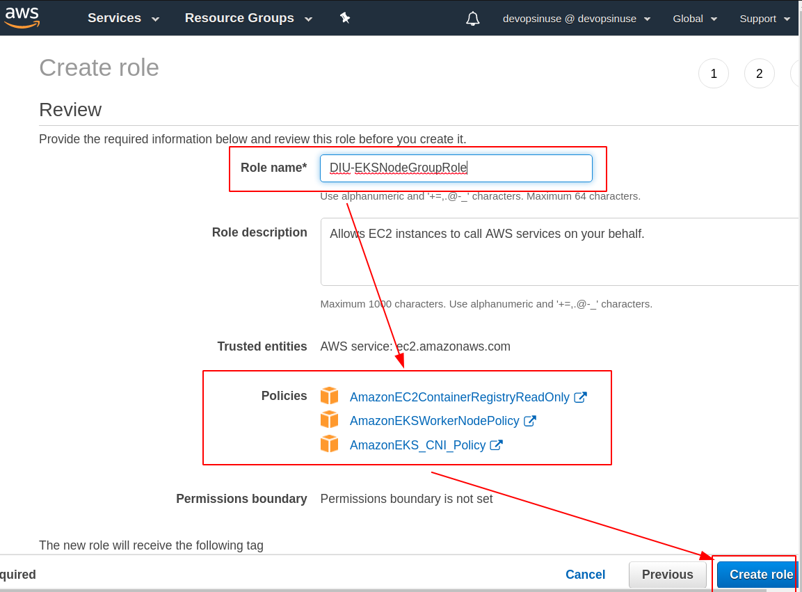

Role ***DIU-EKSNodeGroupRole*** is finally created


<!-- - [9. Create SSH key pain in AWS console](#9-create-ssh-key-pain-in-aws-console)-->
### 9. Create SSH key pain in AWS console


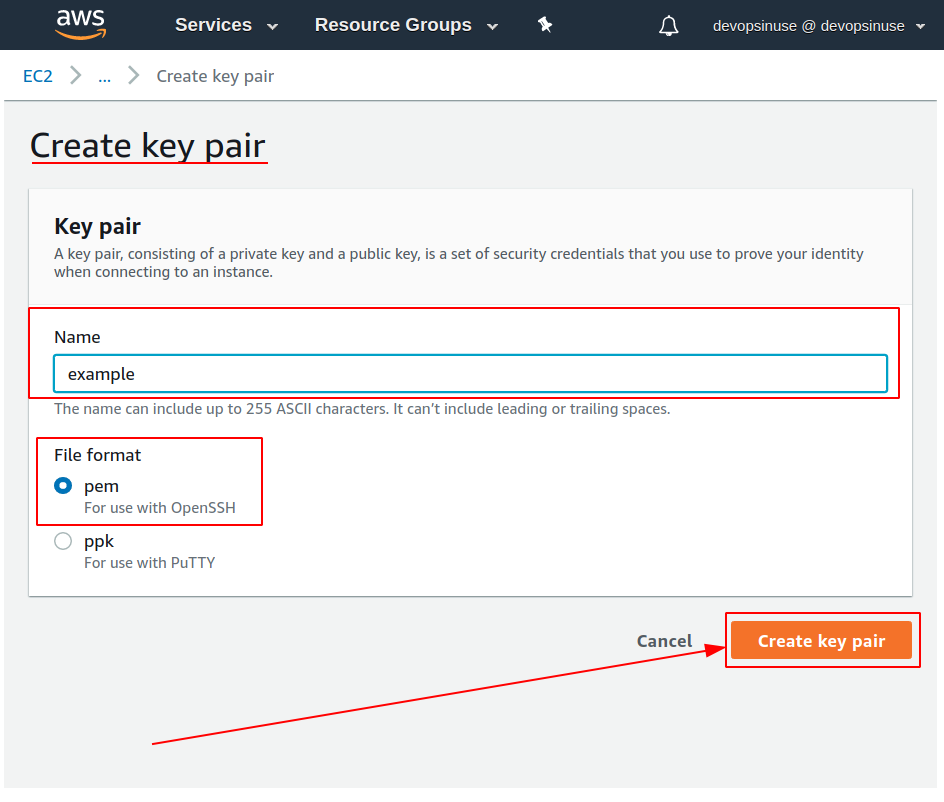


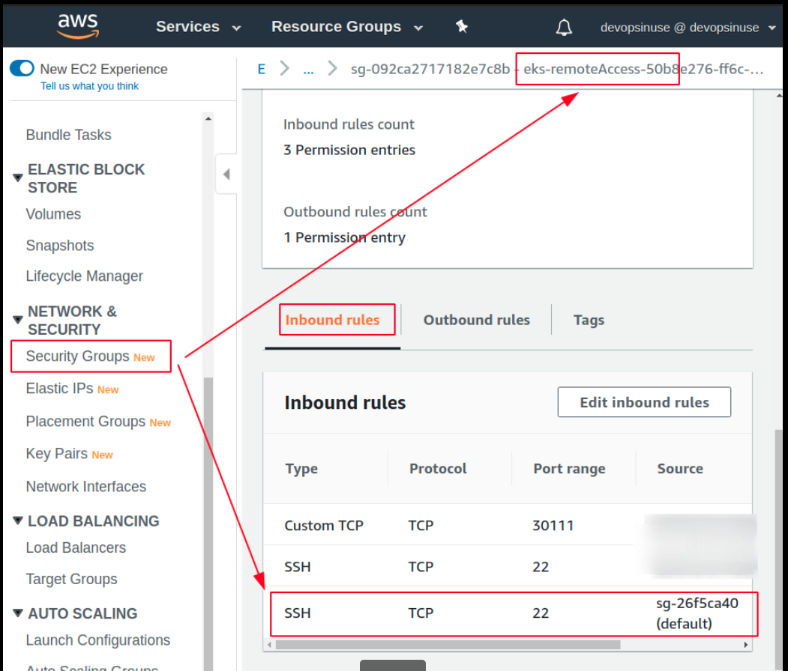


<!-- - [10. Create EKS cluster in AWS web console](#10-create-eks-cluster-in-aws-web-console)-->
### 10. Create EKS cluster in AWS web console


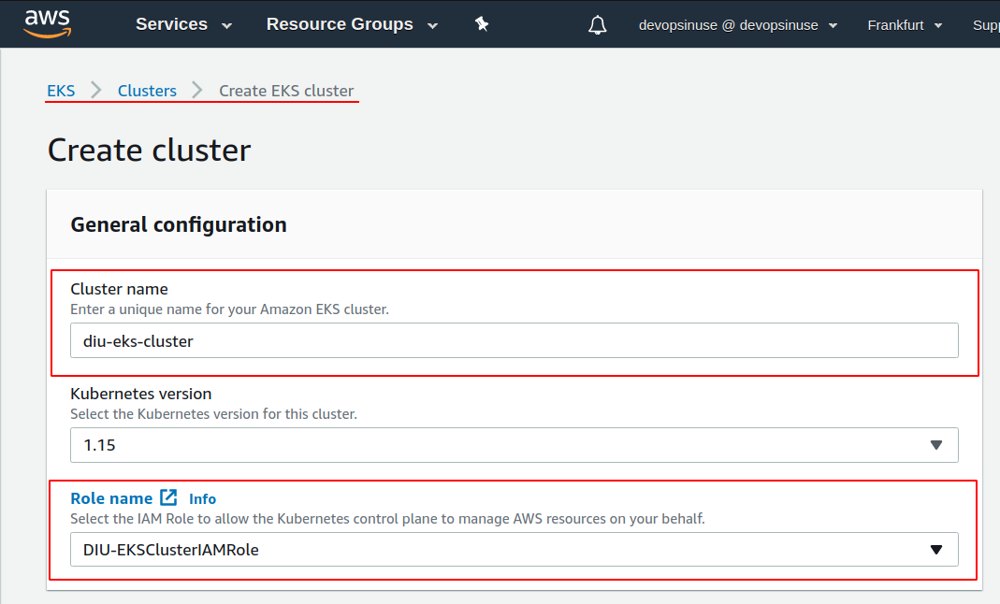


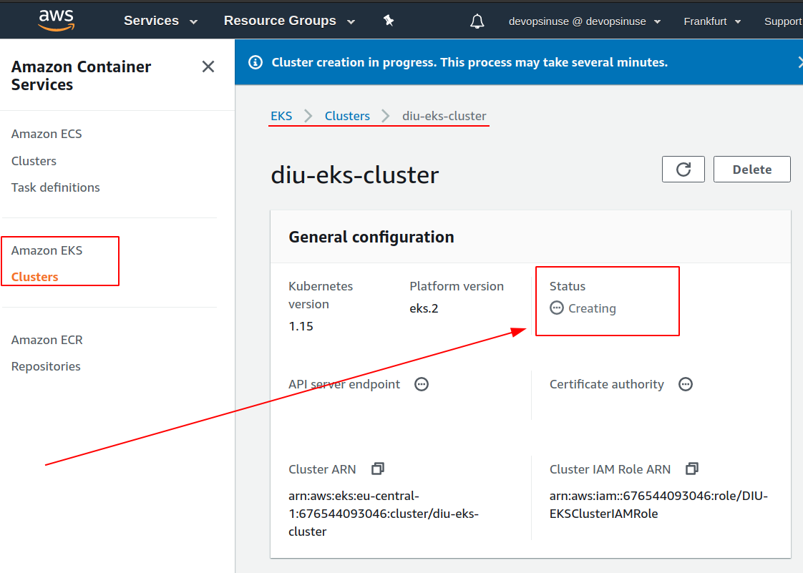


<!-- - [11. Create EKS node group in AWS web console](#11-create-eks-node-group-in-aws-web-console)-->
### 11. Create EKS node group in AWS web console


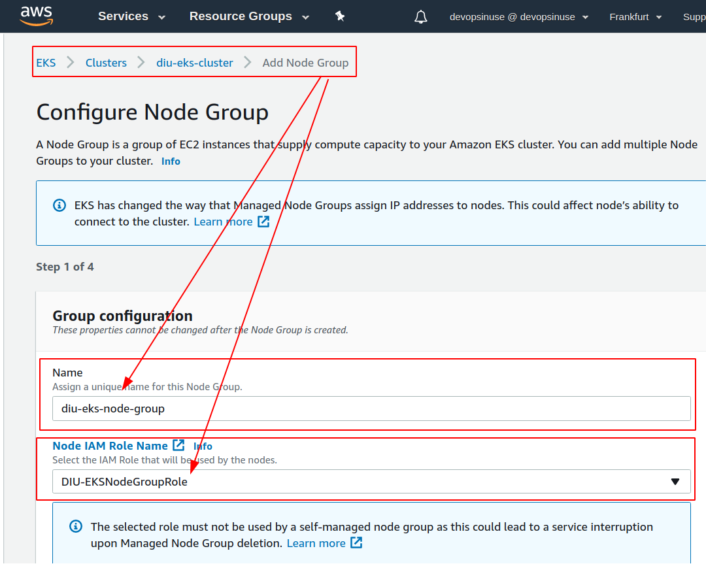


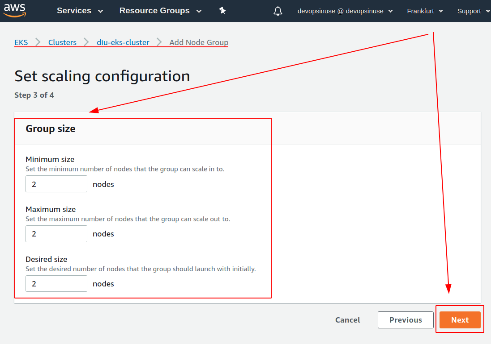


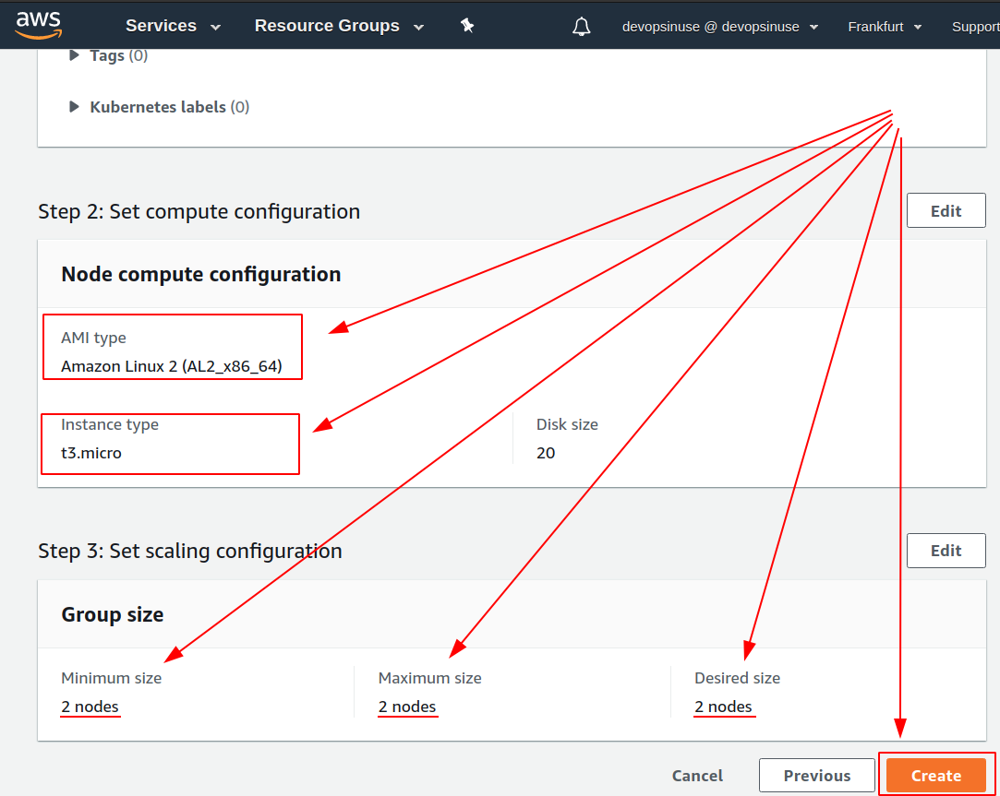

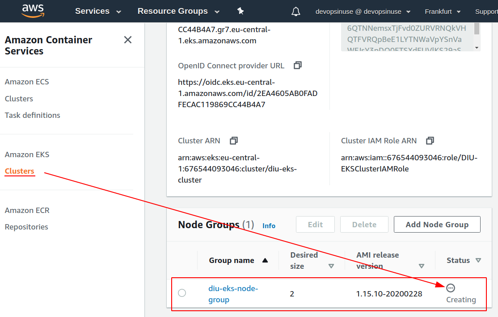


<!-- - [12. Create KUBECONFIG at your local](#12-create-kubeconfig-at-your-local)-->
### 12. Create KUBECONFIG at your local

**Run this** command get the content of your `~/.kube/config` file at your local

```bash
aws eks --region eu-central-1 update-kubeconfig --name diu-eks-cluster --profile devopsinuse

Added new context arn:aws:eks:eu-central-1:611111111116:cluster/diu-eks-cluster to /home/username/.kube/config
```

**If you now go and take** a look what is inside the file: `~/.kube/config`, you will find a correct connection settings to be able to **communicate** with your **AWS EKS Kubernetes cluster** under your **AWS Free Tier account**


Run following commands to make sure that you can communicte with your **AWS EKS Kubernetes cluster** under your **AWS Free Tier account**

```bash
kubectl get nodes
NAME                                            STATUS   ROLES    AGE     VERSION
ip-172-31-20-97.eu-central-1.compute.internal   Ready    <none>   9m2s    v1.15.10-eks-bac369
ip-172-31-3-232.eu-central-1.compute.internal   Ready    <none>   8m55s   v1.15.10-eks-bac369

kubectl get pods -A
NAMESPACE     NAME                       READY   STATUS    RESTARTS   AGE
kube-system   aws-node-ldt44             1/1     Running   0          9m14s
kube-system   aws-node-s6nb9             1/1     Running   0          9m7s
kube-system   coredns-5b6dbb4b59-4rjkm   1/1     Running   0          23m
kube-system   coredns-5b6dbb4b59-bnxs4   1/1     Running   0          23m
kube-system   kube-proxy-ncm6q           1/1     Running   0          9m14s
kube-system   kube-proxy-zffwq           1/1     Running   0          9m7s
```

<!-- - [13. First NGINX deployment by kubectl to AWS EKS cluster created manually](#13-first-nginx-deployment-by-kubectl-to-aws-eks-cluster-created-manually)-->
### 13. First NGINX deployment by kubectl to AWS EKS cluster created manually

```bash
tree deployment-eks-nginx-manual
deployment-eks-nginx-manual
├── deployment-eks-nginx-manual.yaml
├── index-eks-nginx-manual_files
│   ├── bootstrap.min.css
│   ├── bootstrap.min.js
│   ├── Chart.min.js
│   ├── dashboard.css
│   ├── feather.min.js
│   ├── jquery-3.2.1.slim.min.js
│   └── popper.min.js
└── index-eks-nginx-manual.html

```


Create configmap kubernetes object **nginx-cm**
```bash
cd deployment-eks-nginx-manual/

kubectl create configmap nginx-cm \
--from-file=index-eks-nginx-manual.html \
--from-file=index-eks-nginx-manual_files/bootstrap.min.css \
--from-file=index-eks-nginx-manual_files/bootstrap.min.js \ 
--from-file=index-eks-nginx-manual_files/Chart.min.js \
--from-file=index-eks-nginx-manual_files/dashboard.css \
--from-file=index-eks-nginx-manual_files/feather.min.js \
--from-file=index-eks-nginx-manual_files/jquery-3.2.1.slim.min.js \
--from-file=index-eks-nginx-manual_files/popper.min.js
```

**Explore** file: `deployment-eks-nginx-manual.yaml` for creating **deployment** and **service** Kubernetes objects

```yaml
---
apiVersion: apps/v1beta1
kind: Deployment
metadata:
  name: nginx
spec:
  replicas: 1
  template:
    metadata:
      labels:
        app: nginx
    spec:
      containers:
      - name: nginx
        image: nginx
        ports:
        - containerPort: 80
        volumeMounts:
        - mountPath: /usr/share/nginx/html/index.html
          readOnly: true
          name: nginx-cm
          subPath: index.html
        - mountPath: /usr/share/nginx/html/index-eks-nginx-manual_files/bootstrap.min.css
          readOnly: true
          name: nginx-cm
          subPath: bootstrap.min.css
        - mountPath: /usr/share/nginx/html/index-eks-nginx-manual_files/bootstrap.min.js
          readOnly: true
          name: nginx-cm
          subPath: bootstrap.min.js
        - mountPath: /usr/share/nginx/html/index-eks-nginx-manual_files/Chart.min.js
          readOnly: true
          name: nginx-cm
          subPath: Chart.min.js
        - mountPath: /usr/share/nginx/html/index-eks-nginx-manual_files/dashboard.css
          readOnly: true
          name: nginx-cm
          subPath: dashboard.css
        - mountPath: /usr/share/nginx/html/index-eks-nginx-manual_files/feather.min.js
          readOnly: true
          name: nginx-cm
          subPath: feather.min.js
        - mountPath: /usr/share/nginx/html/index-eks-nginx-manual_files/jquery-3.2.1.slim.min.js
          readOnly: true
          name: nginx-cm
          subPath: jquery-3.2.1.slim.min.js
        - mountPath: /usr/share/nginx/html/index-eks-nginx-manual_files/popper.min.js
          readOnly: true
          name: nginx-cm
          subPath: popper.min.js
      
      volumes:
      # Do not forget to run this command up front
      # kubectl create configmap nginx-cm --from-file=index-eks-nginx-manual.html
      - name: nginx-cm
        configMap:
          name: nginx-cm 
          items:
            - key: index-eks-nginx-manual.html
              path: index.html
            - key: bootstrap.min.css
              path: bootstrap.min.css
            - key: bootstrap.min.js
              path: bootstrap.min.js
            - key: Chart.min.js
              path: Chart.min.js
            - key: dashboard.css
              path: dashboard.css
            - key: feather.min.js
              path: feather.min.js
            - key: jquery-3.2.1.slim.min.js
              path: jquery-3.2.1.slim.min.js
            - key: popper.min.js
              path: popper.min.js

              

---
apiVersion: v1
kind: Service
metadata:
  name: nginx
spec:
  type: NodePort
  ports:
  - port: 80
    targetPort: 80
    nodePort: 30111
  selector:
    app: nginx

```
**Allow** port `30111` in ***Security Group*** section in AWS console

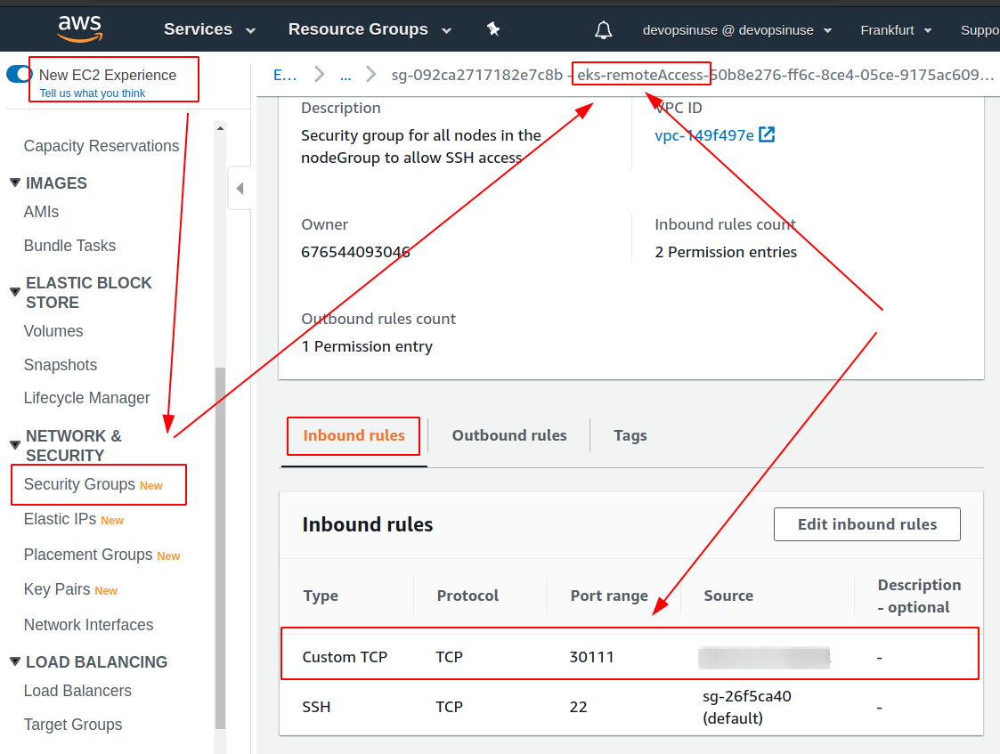


**Execute deployment** of your **Nginx** web server with **custom content**
```bash
kubectl apply -f deployment-eks-nginx-manual.yaml
```

**Retrive** IP Addresses of your **physical nodes** in AWS

```bash
 kubectl get nodes -o wide | awk -F" " '{print $1"\t"$7}'
NAME    EXTERNAL-IP
ip-172-31-20-97.eu-central-1.compute.internal   35.157.105.203
ip-172-31-3-232.eu-central-1.compute.internal   3.121.160.180
```


SSH tunnel approach without the need to seup Security group in AWS

```bash
ssh -o "IdentitiesOnly yes" \
-i  ~/.ssh/devopsinuse.pem \
ec2-user@35.157.105.203 \
-L30111:127.0.0.1:30111
```


Explore Nginx pod by attaching to **a running container**

```bash
kubectl get pods                                    
NAME                     READY   STATUS    RESTARTS   AGE
nginx-6d786774cd-fmtgh   1/1     Running   0          31m

kubectl exec -it  nginx-6d786774cd-fmtgh -- bash
root@nginx-6d786774cd-fmtgh:/# 


root@nginx-6d786774cd-fmtgh:/# ls usr/share/nginx/html/index* -l
-rw-r--r-- 1 root root 10:17 usr/share/nginx/html/index.html

usr/share/nginx/html/index-eks-nginx-manual_files:
total 516
-rw-r--r-- 1 root root  10:17 Chart.min.js
-rw-r--r-- 1 root root  10:17 bootstrap.min.css
-rw-r--r-- 1 root root  10:17 bootstrap.min.js
-rw-r--r-- 1 root root  10:17 dashboard.css
-rw-r--r-- 1 root root  10:17 feather.min.js
-rw-r--r-- 1 root root  10:17 jquery-3.2.1.slim.min.js
-rw-r--r-- 1 root root  10:17 popper.min.js
```


```bash
# get all deployments in default namespace
kubectl get deployment nginx -o yaml         


apiVersion: extensions/v1beta1
kind: Deployment
metadata:
  annotations:
    deployment.kubernetes.io/revision: "1"
    kubectl.kubernetes.io/last-applied-configuration: | 
      {...}
  creationTimestamp: "..."
  generation: 1
  labels:
    app: nginx
  name: nginx
  namespace: default
  resourceVersion: "15772"
  selfLink: /apis/extensions/v1beta1/namespaces/default/deployments/nginx
  uid: 83a88f7c-19f9-40b6-a3e6-76b6afc3f445
spec:
  progressDeadlineSeconds: 600
  replicas: 1
  revisionHistoryLimit: 2
  selector:
    matchLabels:
      app: nginx
  strategy:
    rollingUpdate:
      maxSurge: 25%
      maxUnavailable: 25%
    type: RollingUpdate
  template:
    metadata:
      creationTimestamp: null
      labels:
        app: nginx
    spec:
      containers:
      - image: nginx
        imagePullPolicy: Always
        name: nginx
        ports:
        - containerPort: 80
          protocol: TCP
        resources: {}
        terminationMessagePath: /dev/termination-log
        terminationMessagePolicy: File
        volumeMounts:
        - mountPath: /usr/share/nginx/html/index.html
          name: nginx-cm
          readOnly: true
          subPath: index.html
        - mountPath: /usr/share/nginx/html/index-eks-nginx-manual_files/bootstrap.min.css
          name: nginx-cm
          readOnly: true
          subPath: bootstrap.min.css
        - mountPath: /usr/share/nginx/html/index-eks-nginx-manual_files/bootstrap.min.js
          name: nginx-cm
          readOnly: true
          subPath: bootstrap.min.js
        - mountPath: /usr/share/nginx/html/index-eks-nginx-manual_files/Chart.min.js
          name: nginx-cm
          readOnly: true
          subPath: Chart.min.js
        - mountPath: /usr/share/nginx/html/index-eks-nginx-manual_files/dashboard.css
          name: nginx-cm
          readOnly: true
          subPath: dashboard.css
        - mountPath: /usr/share/nginx/html/index-eks-nginx-manual_files/feather.min.js
          name: nginx-cm
          readOnly: true
          subPath: feather.min.js
        - mountPath: /usr/share/nginx/html/index-eks-nginx-manual_files/jquery-3.2.1.slim.min.js
          name: nginx-cm
          readOnly: true
          subPath: jquery-3.2.1.slim.min.js
        - mountPath: /usr/share/nginx/html/index-eks-nginx-manual_files/popper.min.js
          name: nginx-cm
          readOnly: true
          subPath: popper.min.js
      dnsPolicy: ClusterFirst
      restartPolicy: Always
      schedulerName: default-scheduler
      securityContext: {}
      terminationGracePeriodSeconds: 30
      volumes:
      - configMap:
          defaultMode: 420
          items:
          - key: index-eks-nginx-manual.html
            path: index.html
          - key: bootstrap.min.css
            path: bootstrap.min.css
          - key: bootstrap.min.js
            path: bootstrap.min.js
          - key: Chart.min.js
            path: Chart.min.js
          - key: dashboard.css
            path: dashboard.css
          - key: feather.min.js
            path: feather.min.js
          - key: jquery-3.2.1.slim.min.js
            path: jquery-3.2.1.slim.min.js
          - key: popper.min.js
            path: popper.min.js
          name: nginx-cm
        name: nginx-cm
status:
  availableReplicas: 1
  conditions:
   ...
    type: Progressing
  observedGeneration: 1
  readyReplicas: 1
  replicas: 1
  updatedReplicas: 1

```


```bash
kubectl get service  nginx -o yaml
apiVersion: v1
kind: Service
metadata:
  annotations:
    kubectl.kubernetes.io/last-applied-configuration: |
      {}
  creationTimestamp: "..."
  name: nginx
  namespace: default
  resourceVersion: "15759"
  selfLink: /api/v1/namespaces/default/services/nginx
  uid: 67ad2770-154a-4dc4-aa32-a4c2d53af8d2
spec:
  clusterIP: 10.100.210.78
  externalTrafficPolicy: Cluster
  ports:
  - nodePort: 30111
    port: 80
    protocol: TCP
    targetPort: 80
  selector:
    app: nginx
  sessionAffinity: None
  type: NodePort
status:
  loadBalancer: {}
```

<!-- - [14. Clean up Network Interfaces](#14-clean-up-network-interfaces)-->
### 14. Clean up Network Interfaces


<!-- - [15. Clean up AWS EKS node group](#15-clean-up-aws-eks-node-group)-->
### 15. Clean up AWS EKS node group

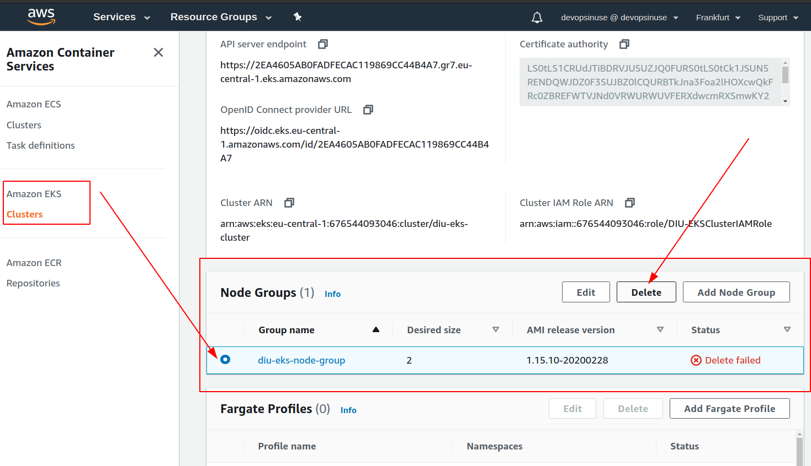

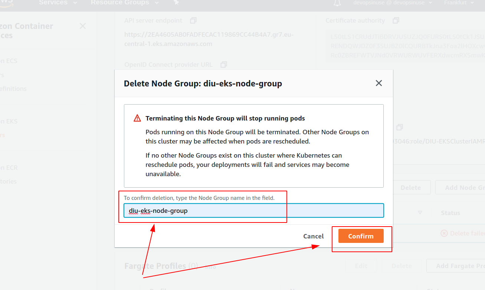


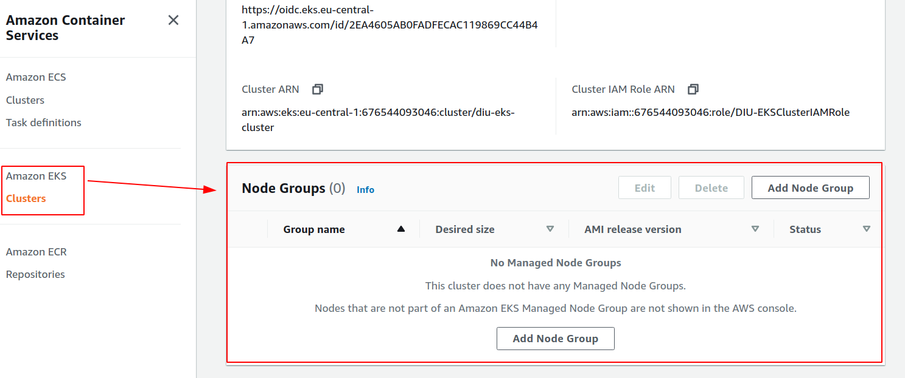


<!-- - [16. Clean up AWS EKS control plane](#16-clean-up-aws-eks-control-plane)-->
### 16. Clean up AWS EKS control plane


<!-- - [17. Delete AWS IAM roles](#17-delete-aws-iam-roles)-->
### 17. Delete AWS IAM roles


# 2. Using terrafrom to manage AWS EKS cluster

<!-- - [18. Install terrafrom binary at your local](#18-install-terrafrom-binary-at-your-local)-->
### 18. Install terrafrom binary at your local

Link: https://www.terraform.io/downloads.html


**Download** `*.zip` file from the lin below. **Unzip** files to a proper location at your local e.g. `/usr/bin`.

```bash
curl -L --output /tmp/terraform.zip  \
https://releases.hashicorp.com/terraform/0.12.24/terraform_0.12.24_linux_amd64.zip

sudo unzip -d /usr/bin/ /tmp/terraform.zip 

terraform -version
Terraform v0.12.24
```

<!-- - [19. Run terrafrom init and validate to initialize required plugins](#19-run-terrafrom-init-and-validate-to-initialize-required-plugins)-->
### 19. Run terrafrom init and validate to initialize required plugins

Navigate to `eks-terraform` folder and list it to see the **terrafrom files**

```bash
cd eks-terraform
tree
.
├── iam.tf
├── main.tf
├── outputs.tf
├── sg.tf
├── subnets.tf
├── terraform.eks.tfvars
├── terraform.eks.tfvars.git
├── terraform.tfstate
└── variables.tf
```
* Most of the files have completly **commented lines** for now.
* When **touching this code** for the first time, there should be no hidden `.terrafrom` folder present. 
* `.terraform` folder stores all neceassary **terrafrom plugins** used within this code
* **plugins** will be downloaded to `terraform` folder  after `terraform init` command run

```bash
 …  sbx  aws-eks-devopsinuse  eks-terraform   master ✚ 1 … 1  terraform init 

Initializing the backend...

Initializing provider plugins...
- Checking for available provider plugins...
- Downloading plugin for provider "aws" (hashicorp/aws) 2.60.0...

The following providers do not have any version constraints in configuration,
so the latest version was installed.

To prevent automatic upgrades to new major versions that may contain breaking
changes, it is recommended to add version = "..." constraints to the
corresponding provider blocks in configuration, with the constraint strings
suggested below.

* provider.aws: version = "~> 2.60"

Terraform has been successfully initialized!

You may now begin working with Terraform. Try running "terraform plan" to see
any changes that are required for your infrastructure. All Terraform commands
should now work.

If you ever set or change modules or backend configuration for Terraform,
rerun this command to reinitialize your working directory. If you forget, other
commands will detect it and remind you to do so if necessary.
```

**Take a look** what is now stored in `.terraform` folder

```bash
 …  sbx  aws-eks-devopsinuse  eks-terraform   master ✚ 1 … 3  tree .terraform 
.terraform
└── plugins
    └── linux_amd64
        ├── lock.json
        └── terraform-provider-aws_v2.60.0_x4

2 directories, 2 files
```


<!-- - [20. Fill up terraform.eks.tfvars file with your AWS security credentials](#20-fill-up-terraform-eks-tfvars-file-with-your-aws-security-credentials)-->
### 20. Fill up terraform.eks.tfvars file with your AWS security credentials

* to start using **terrafrom** it only takes few commands to learn in the begining
* most comonly used commands will be:
  - `terraform init`
  - `terraform plan`
  - `terraform apply`
  - `terraform destroy`
  - `terraform show`
  - `terraform console`
  - `terraform validate`
  - `terraform fmt -recursive`
<br/>
<br/>
* Before running `terraform plan` and `terraform apply` to see what the code is about to create - it is **neceassary** to setup credentials to make **terrafrom** binary talk to AWS.

* there are **several main ways** how to setup this communication: 
  - **(1)** export **env. variables** to console you are using:

    `export AWS_ACCESS_KEY_ID="..."` <br/>
    `export AWS_SECRET_ACCESS_KEY="..."` <br/>
    `export AWS_DEFAULT_REGION="eu-central-1"`

  - **(2)** configure **two files** (since we configured **aws cli** `--profile`):

    `~/.aws/credentials`<br/>
    `~/.aws/config`<br/> 
    `export AWS_PROFILE="devopsinuse"`
  - **(3)** use `-var-file` **flag** when running `terrafrom <command> -var-file terraform.eks.tfvars`<br/>
    `terraform destroy  -var-file terraform.eks.tfvars`

**Please** fill up file: `terraform.eks.tfvars`


```bash
 …  sbx  aws-eks-devopsinuse  eks-terraform   master ✚ 1 … 1  cat terraform.eks.tfvars
aws_region     = "eu-central-1"
aws_access_key = "A...C"
aws_secret_key = "G...K"
ssh_public_key = "/home/<username>/.ssh/eks-aws.pub"
custom_tags = {
  Name      = "diu-eks-cluster-tag"
  Terraform = "true"
  Delete    = "true"
}

eks-cluster-name = "diu-eks-cluster"
```


**Generate SSH key** pair:
```bash
SSH_KEYS=~/.ssh/eks-aws

if [ ! -f "$SSH_KEYS" ]
then
   echo -e "\nCreating SSH keys ..."
   ssh-keygen -t rsa -C "eks-aws" -N '' -f $SSH_KEYS
else
   echo -e "\nSSH keys are already in place\!"
fi
```

<!-- - [21. Run terrafrom plan and terrafrom apply](#21-run-terrafrom-plan-and-terrafrom-apply)-->
### 21. Run terrafrom plan and terrafrom apply

**Run** `terraform validate` and `terraform fmt -recursive` first to validate the code and do a proper formatting of the terrafrom code

```bash
 …  sbx  aws-eks-devopsinuse  eks-terraform   master ✚ 1  terraform validate
Success! The configuration is valid.

 …  sbx  aws-eks-devopsinuse  eks-terraform   master ✚ 1  terraform fmt -recursive
```

* it's mostly refered that **terraform** has 3 main files with a correspondng naming convention:
  - `main.tf`
  - `variables.tf`
  - `outputs.tf`
  - `----------------`
  - `terraform.eks.tfvars` (extra var file)


`terraform plan` will throw an **error**:
```bash
terrafrom plan

var.aws_access_key
  AWS region
  Enter a value: 
```


run: `terraform plan -var-file terraform.eks.tfvars` with **an extra flag**: `-var-file`

```bash
terraform plan -var-file terraform.eks.tfvars
Refreshing Terraform state in-memory prior to plan...
The refreshed state will be used to calculate this plan, but will not be
persisted to local or remote state storage.

data.aws_vpc.default: Refreshing state...
data.aws_availability_zones.default: Refreshing state...
data.aws_subnet_ids.default: Refreshing state...

------------------------------------------------------------------------

No changes. Infrastructure is up-to-date.

This means that Terraform did not detect any differences between your
configuration and real physical resources that exist. As a result, no
actions need to be performed.
```

The **reason** why terrafrom is not going to do anything special in paricular is that **most of the files are commented**. There are just few lines without comments in `main.tf`file. 

However, the files `variables.tf` and `outputs.tf` keep **few active (uncommented) lines** and once `terraform apply -var-file terraform.eks.tfvars` is executed, there will be some output.


**Run** `terraform apply -var-file terraform.eks.tfvars` command:

```bash
terraform apply -var-file terraform.eks.tfvars

data.aws_availability_zones.default: Refreshing state...
data.aws_vpc.default: Refreshing state...
data.aws_subnet_ids.default: Refreshing state...

Apply complete! Resources: 0 added, 0 changed, 0 destroyed.

Outputs:

aws_availability_zones = {
  "group_names" = [
    "eu-central-1",
  ]
  "id" = "..."
  "names" = [
    "eu-central-1a",
    "eu-central-1b",
    "eu-central-1c",
  ]
  "state" = "available"
  "zone_ids" = [
    "euc1-az2",
    "euc1-az3",
    "euc1-az1",
  ]
}
aws_subnet_ids = {
  "id" = "vpc-111117e"
  "ids" = [
    "subnet-1f3cc963",
    "subnet-9b75cbf1",
    "subnet-ca01f986",
  ]
  "vpc_id" = "vpc-111117e"
}
vpc_id = vpc-111117e
```


### 22. Run terraform apply uncomment iam.tf to create mandatory AWS IAM roles 
### 23. Run terraform apply uncomment sg.tf to create mandatory Security Group 
### 24. Run terraform apply uncomment subnets.tf to create Subnets in AWS 
### 25. Run terraform apply uncomment aws_eks_cluster in main.tf to create AWS EKS cluster control plane
### 26. Run terraform apply uncomment aws_eks_node_group in main.tf to create AWS EKS node group
### 27. Explore terrafrom console commands with custom tags variable
### 28. First NGINX deployment by kubectl to AWS EKS cluster created by terraform
### 29. How to destroy AWS EKS by terrafrom destroy

3. Helm charts
### 29. Install helm v3 and helmfile binaries
### 30. Create your own NGINX helm chart
### 31. Deploy NGINX helm chart via helm v3
### 32. Deploy PostgreSQL helm chart from stable helm chart repository
### 33. Self written micro backend helm chart
### 34. Self written micro frontend helm chart
### 35. Nginx ingress controller helm chart
### 36. Creating own helm chart repository from Github account
### 36. Creating own helm chart repository from Chartmuseum


### How to create KUBECONFIG for EKS cluster
```bash
aws eks --region eu-central-1 update-kubeconfig --name diu-eks-cluster
```

### How to test cluster by running PostgreSQL deployment via helmfile

Export variables
```bash
export HC_ALLOWED_IPS="172.31.0.0/16"
export HC_DB="microservice"
export HC_DB_USER="micro"
export HC_DB_PASS="password"
export HC_MASTER_DB_PASS="password"
export HC_MASTER_DB_USER="postgres"
```

Template your deployment first
```bash
helmfile -f helmfile-postgresql.yaml template
```

Execute PostgreSQL deployment
```bash
helmfile -f helmfile-postgresql.yaml sync
```

Test your AWS PostgreSQL deployment
```bash
kubectl run postgresql-client --rm --tty -i --restart='Never' --namespace default --image "docker.io/bitnami/postgresql:11.7.0-debian-10-r82" --env="PGPASSWORD=password" --command -- psql --host postgresql -U micro -d microservice -p 5432                                                        

If you don't see a command prompt, try pressing enter.

microservice=> 
microservice=> 
microservice=> 
microservice=> 

```


