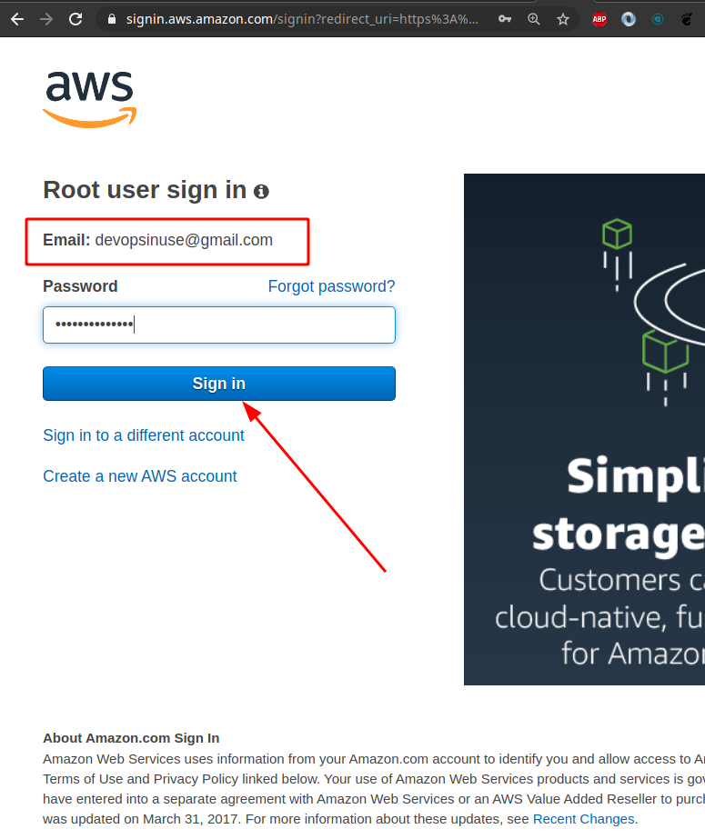
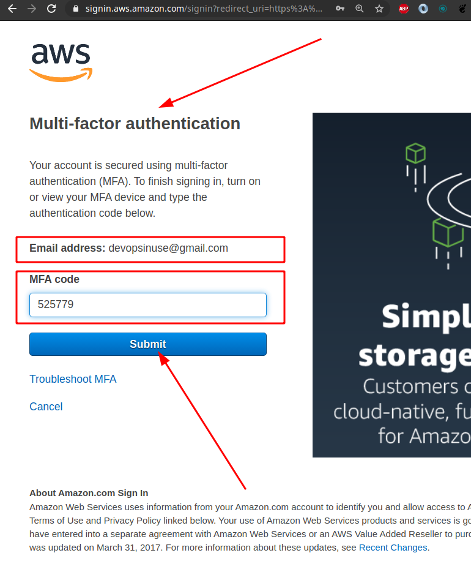
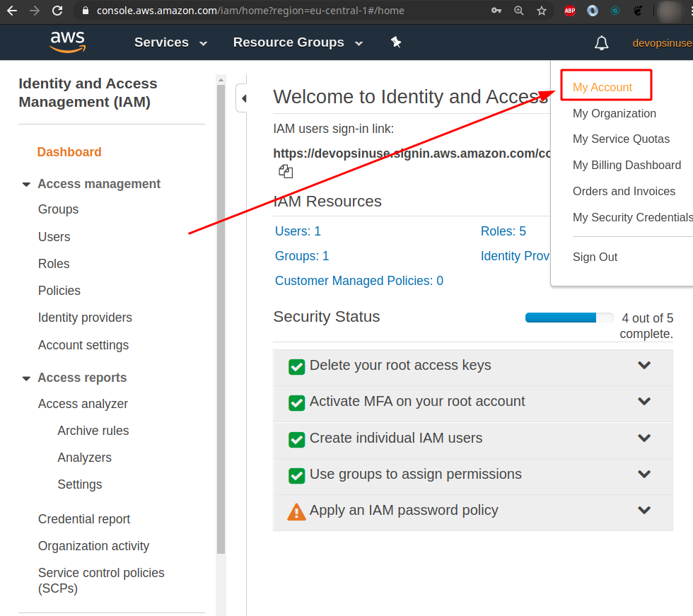
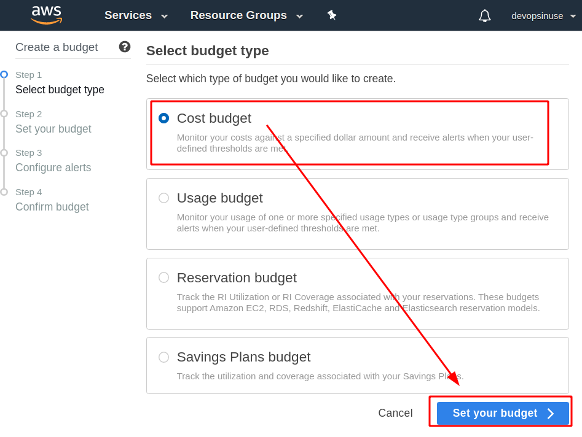
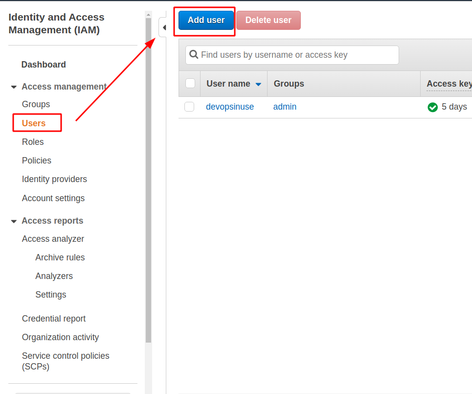
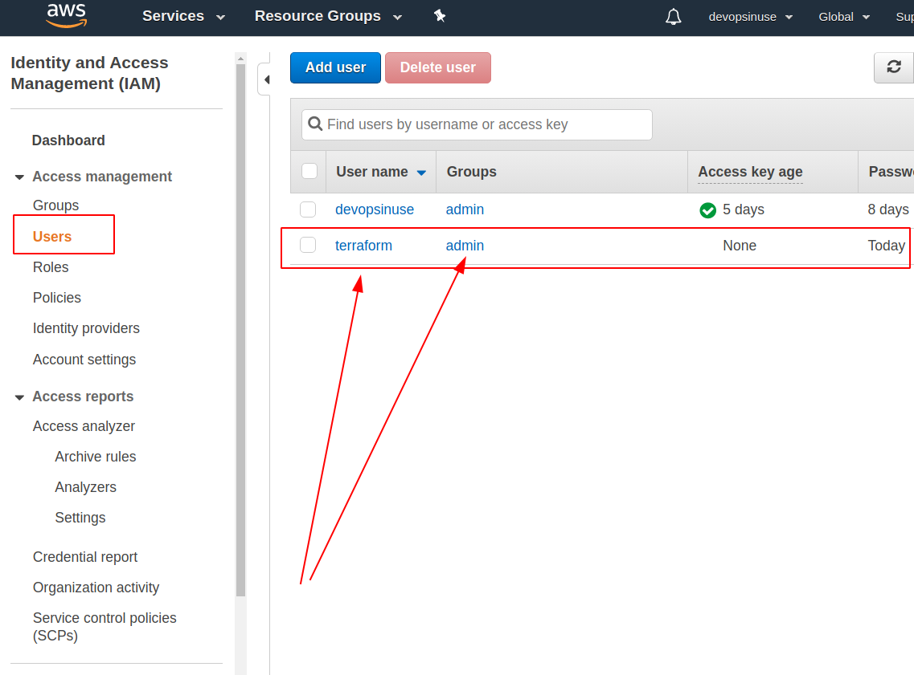
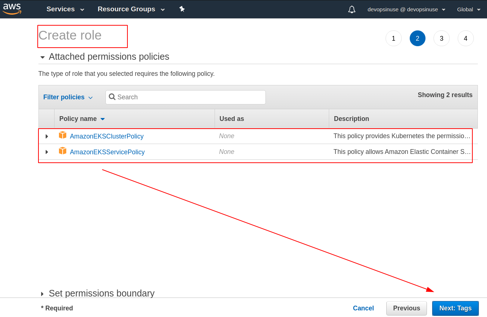
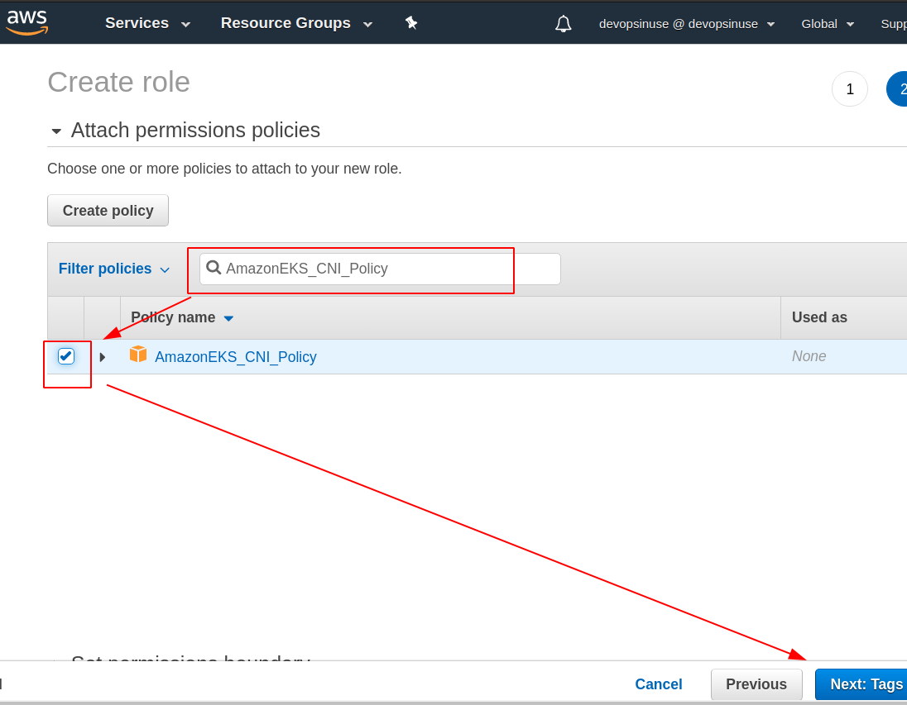
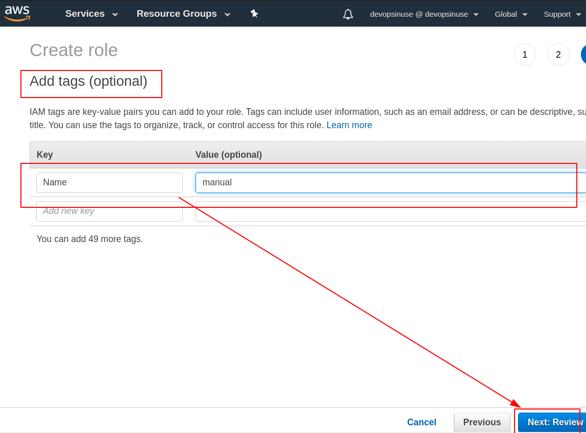

1. Starting AWS EKS cluster manually in AWS web console
### 1. EKS cluster costs few cents per hour

### 2. Allow seeing billing data for IAM user

* Login to your **root** AWS account in **AWS Free Tier**.<br/>
* The access to a **billing information** is **disabled** by default for **IAM accounts**


* **Input user/password** from your phone to authenticate and login to the **root** account.<br/> 



* **Input MFA code** from your phone to authenticate and login to the **root** account.<br/> 



* Click at **My Account** item from **drop down menu**



* Click **Edit** to allow - ***Activate IAM Access*** for other IAM accounts than root account.


* Hit **Update** button to take ***Activate IAM Access*** for other IAM accounts than root account.


### 3. Create budget in AWS to be notified by email





### 4. Create an extra user and group in AWS with admin privilages








### 6. Install awscli and kubectl binaries

* **Install** awscli binary
https://docs.aws.amazon.com/cli/latest/userguide/install-linux-al2017.html

* Please **configure** these two files:
  - ~/.aws/credentials
  - ~/.aws/config


Link: https://kubernetes.io/docs/tasks/tools/install-kubectl/

```
curl -LO https://storage.googleapis.com/kubernetes-release/release/v1.18.0/bin/linux/amd64/kubectl
chmod +x ./kubectl
sudo mv ./kubectl /usr/local/bin/kubectl
kubectl version --client
```


### 7. Retrive programatic access from AWS and configure aws cli


**edit file:** `~/.aws/credentials`
```bash
vim  ~/.aws/credentials

...
[terraform]
aws_access_key_id = ...
aws_secret_access_key = ...

[devopsinuse]
aws_access_key_id = ...
aws_secret_access_key = ...
...

:wq!
```

**edit file:** `~/.aws/config`

```bash
vim ~/.aws/config

...
[profile terraform]
region=eu-central-1

[profile devopsinuse]
region=eu-central-1
...

:wq!
```

**Make sure** that your `aws` is configured correctly and can talk to AWS
```bash
aws iam list-users --profile devopsinuse
{
    "Users": [
        {
            "Path": "/",
            "UserName": "devopsinuse",
            "UserId": "AFSDFSDFSDFSDFSD",
            "Arn": "arn:aws:iam::61111111116:user/devopsinuse",
            "CreateDate": "2020-04-20T08:03:36Z",
            "PasswordLastUsed": "2020-04-28T18:25:07Z"
        },
        {
            "Path": "/",
            "UserName": "terraform",
            "UserId": "ADSGDSDASDASFSDFSDB",
            "Arn": "arn:aws:iam::61111111116:user/terraform",
            "CreateDate": "2020-04-28T10:24:32Z"
        }
    ]
}
```
### 8. Create EKS control plane IAM role in AWS web console





### 9. Create EKS node group  IAM role in AWS web console

Find **Roles** section under ***Identity and Access Management (IAM)***


Click at ***EC2*** from *Choose a use case* menu when creating AWS IAM role for ***EKS node group***


**Search manually** for these **3 policies** for **EKS node group** and 
mark then once found in **checkbox**
* *AmazonEC2ContainerRegistryReadOnly*


**Search manually** for these **3 policies** for **EKS node group** and 
mark then once found in **checkbox**
* *AmazonEKSWorkerNodePolicy*


**Search manually** for these **3 policies** for **EKS node group** and 
mark then once found in **checkbox**
* *AmazonEKS_CNI_Policy*

This time you can ***click: Next: Tags*** blue button if all **three** *IAM Policies* are **check-boxed**



**Tags are optional** however, they help to identify leftovers once you want to clean your AWS account




**Review** your AWS IAM role and assign some **Role name** to it ***e.g. DIU-EKSNodeGroupRole***


Role ***DIU-EKSNodeGroupRole*** is finally created


### 10. Create EKS cluster in AWS web console
### 11. Create EKS node group in AWS web console
### 12. Create KUBECONFIG at your local
### 13. First NGINX deployment by kubectl to AWS EKS cluster created manually

2. Using terrafrom to manage AWS EKS cluster
### 14. Install terrafrom binary at your local
### 15. Run terrafrom init and validate to initialize required plugins
### 16. Fill up terraform.eks.tfvars file with your AWS security credentials
### 17. Run terrafrom plan and terrafrom apply
### 18. Run terraform apply uncomment iam.tf to create mandatory AWS IAM roles 
### 19. Run terraform apply uncomment sg.tf to create mandatory Security Group 
### 20. Run terraform apply uncomment subnets.tf to create Subnets in AWS 
### 21. Run terraform apply uncomment aws_eks_cluster in main.tf to create AWS EKS cluster control plane
### 22. Run terraform apply uncomment aws_eks_node_group in main.tf to create AWS EKS node group
### 23. Explore terrafrom console commands with custom tags variable
### 24. First NGINX deployment by kubectl to AWS EKS cluster created by terraform
### 25. How to destroy AWS EKS by terrafrom destroy

3. Helm charts
### 26. Install helm v3 and helmfile binaries
### 27. Create your own NGINX helm chart
### 28. Deploy NGINX helm chart via helm v3
### 29. Deploy PostgreSQL helm chart from stable helm chart repository
### 30. Self written micro backend helm chart
### 31. Self written micro frontend helm chart
### 32. Nginx ingress controller helm chart
### 33. Creating own helm chart repository from Github account
### 33. Creating own helm chart repository from Chartmuseum


### How to create KUBECONFIG for EKS cluster
```bash
aws eks --region eu-central-1 update-kubeconfig --name diu-eks-cluster
```

### How to test cluster by running PostgreSQL deployment via helmfile

Export variables
```bash
export HC_ALLOWED_IPS="172.31.0.0/16"
export HC_DB="microservice"
export HC_DB_USER="micro"
export HC_DB_PASS="password"
export HC_MASTER_DB_PASS="password"
export HC_MASTER_DB_USER="postgres"
```

Template your deployment first
```bash
helmfile -f helmfile-postgresql.yaml template
```

Execute PostgreSQL deployment
```bash
helmfile -f helmfile-postgresql.yaml sync
```

Test your AWS PostgreSQL deployment
```bash
kubectl run postgresql-client --rm --tty -i --restart='Never' --namespace default --image "docker.io/bitnami/postgresql:11.7.0-debian-10-r82" --env="PGPASSWORD=password" --command -- psql --host postgresql -U micro -d microservice -p 5432                                                        

If you don't see a command prompt, try pressing enter.

microservice=> 
microservice=> 
microservice=> 
microservice=> 

```


